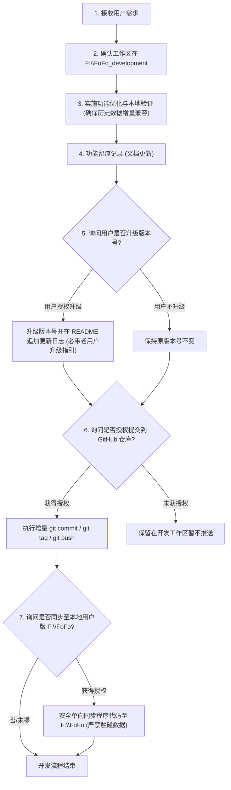

# 🤖 FoFo AI 协作开发准则与行为铁律 (AI Development Rules & Protocol)

> **适用对象**：所有接入本项目进行代码迭代、功能重构、缺陷修复的 AI Assistant / Agent 及人类开发者。  
> **生效范围**：`F:\FoFo_development`（演进开发仓库）与 `F:\FoFo`（用户本地生产环境）。  
> **核心原则**：环境物理隔离、版本严格授权、提交绝对可控、隐私至高无上。

---

## 目录
1. [双轨环境隔离架构说明](#1-双轨环境隔离架构说明)
2. [AI 协作开发五大核心红线规则](#2-ai-协作开发五大核心红线规则)
3. [版本迭代与 Git 发布标准化流程](#3-版本迭代与-git-发布标准化流程)
4. [AI 每次交互前检查清单 (Pre-flight Checklist)](#4-ai-每次交互前检查清单-pre-flight-checklist)

---

## 1. 双轨环境隔离架构说明

为了彻底解决“日常个人使用”与“开源版本迭代”的数据交织与泄密隐患，本项目严格实行**双轨物理隔离机制**：

| 目录路径 | 环境角色 | 职责定位 | Git 仓库属性 |
| :--- | :--- | :--- | :--- |
| **`F:\FoFo_development`** | **演进开发仓库 (Dev Repo)** | • 所有新功能探索、Bug 修复、UI 美工与重构的唯一工作区； • 代码提交与向 GitHub 推送的唯一源头。 | **关联远程**：`https://github.com/Flin-L/FoFo.git` （纯净代码，禁止放置真实个人工作数据） |
| **`F:\FoFo`** | **用户本地生产版 (User Local)** | • 用户本人日常实际记录工作流、日程、备忘、待办的真实生产环境； • 存放用户真实私密工作数据。 | **无远程仓库 (禁止推送)**：已物理移除 `origin` 远端地址，绝对禁止向外提交。 |

---

## 2. AI 协作开发五大核心红线规则

所有接手开发的 AI 必须无条件恪守以下五条铁律：

### 🔴 规则一：版本号自定禁止与授权机制 (Version Authorization Rule)
- **严格留痕**：每次优化功能、重构或修复问题时，必须在对应交付说明或 `docs/` 中记录详细的技术实施过程与改动明细（留痕可溯）；
- **严禁私自升级版本号**：**AI 绝对不允许自行决定或修改版本号**（严禁在用户未明确要求时擅自 bump version，如擅自将 v1.1.0 改为 v1.2.0 或 v2.0.0）；
- **主动询问与授权**：完成功能优化后，AI 可主动向用户建议并询问：“本次优化已就绪，是否需要为此功能升级版本号？建议版本为 vX.Y.Z”；
- **未获授权的处理**：**若用户未明确授权，AI 只能完成功能与代码优化，严格保持当前版本号不变！**

---

### 🔴 规则二：提交 GitHub 之前必须经过用户明确授权 (Pre-Push Authorization Rule)
- **严禁擅自提交与推送**：功能优化或修复完成后，**AI 绝对不得擅自执行 `git commit` 或 `git push` 到远程仓库**；
- **强制审批机制**：代码编写并本地验证通过后，AI 必须向用户汇报改动摘要，并明确询问：“本次功能优化已测试完毕，是否授权提交并推送到 GitHub 仓库？”；
- **只有在收到用户明确的“确认提交”、“同意推送”、“可以发布”等指令后，方可执行 Git 提交与推送操作**。

---

### 🔴 规则三：增量发布与多版本溯源留痕 (Incremental Release & Traceability)
- **增量提交，严禁历史覆盖**：提交仓库时，必须采用标准 Git 增量提交方式，**绝对禁止使用 `git push --force` 或重写历史的 Rebase 操作覆盖前序提交**，必须完整保留每一次历史 Commit；
- **明晰 Changelog**：每次在获得用户授权发布新版本时，必须在 `README.md` 的更新日志板块中清晰注明本版本的新增特性 (Added)、体验改进 (Changed) 与缺陷修复 (Fixed)；
- **提供多版本可追溯下载**：每次发布必须打上规范的语义化 Git 标签（例如 `git tag -a v1.1.0 -m "Release v1.1.0 ..."`），确保 GitHub Releases 能够随时溯源并下载历史不同版本的完整源码包。

---

### 🔴 规则四：本地用户版同步与隐私绝对红线 (Local Sync & Privacy Red Line)
- **合规同步机制**：在 `F:\FoFo_development` 完成功能优化并通过测试后，AI 可以主动询问用户：“是否同步更新你的本地用户版 (`F:\FoFo`)？”；
- **安全增量同步**：在获得用户明确批准后，AI 可将新版代码文件（如 `index.html`、`css/`、`js/`、`server.py`、`start.bat`、`README.md` 等）单向复制覆盖到 `F:\FoFo`；
- **严禁覆盖用户数据**：**绝对禁止覆盖或破坏用户在 `F:\FoFo` 下的个人数据文件**（包括 `data/workspace.json`、`documents/reading_*.json`、`exports/*.md` 等）；
- **最高隐私禁令（绝对红线）**：**绝对不允许在 `F:\FoFo` 目录下执行任何 Git 远程推送！`F:\FoFo` 包含用户真实使用数据与商业/个人隐私，泄露即属最高严重级事故，严禁越界！**

---

### 🔴 规则五：数据结构增量兼容与升级无损红线 (Incremental Schema Compatibility & Lossless Migration Rule)
- **严禁破坏性重构 (No Breaking Schema Changes)**：
  - 严禁对既有持久化数据结构进行破坏性字段重命名、层次抹平或强依赖删除（包括 `data/workspace.json`、`documents/reading_*.json`、`.FoFoAI/sessions.json` 及 `localStorage` 既有配置键名）；
  - 必须始终假定用户正在使用旧版本生成的数据文件，任何改动不得导致旧数据加载时报错、数据截断或功能失效。
- **纯增量扩展与安全兜底原则 (Additive-Only & Default Fallbacks)**：
  - 新增特性需扩展数据字段时，必须采用纯增量扩展模式（如增加可选字段 `priority`、`tags`、`op` 等）；
  - 数据读取与解析层（如前端 `initData`、各模块状态加载器及后端读取接口）**必须提供默认值兜底机制 (Fallback)**，例如 `task.priority = task.priority || 'P1'`，确保读取未包含新字段的历史数据时依然 100% 正常稳定运行，绝不允许抛出 `TypeError: Cannot read properties of undefined`。
- **独立扩展偏好隔离 (Isolated Preference Storage)**：
  - 与主工作台核心业务（目标、日程、待办、日志）弱相关的个性化偏好（如特定新皮肤样式、桌面伴侣拖拽坐标等），应采用独立命名的存储键（如 `localStorage.getItem('fofo_ai_skin_config_v1')`）进行隔离存储，严禁直接污染或耦合主工作台核心 Schema。
- **发布更新日志强制附带平滑升级指引 (Mandatory Migration Guide in Changelog)**：
  - 每次版本升级（无论 Minor 还是 Patch），在 `README.md` 与 Release 说明中**必须明确附带【老用户平滑升级指引 (Data Migration Guide)】**，说明独立桌面版 (`FoFo.exe`) 覆盖更新方法、数据继承状态及安全备份建议，确保用户升级零焦虑、数据零丢失。

---

### 🔴 规则六：UI 设计去 Emoji 纯净克制红线 (Clean UI & No-Emoji Rule)
- **严格禁止滥用 Emoji**：在后续所有 UI 界面设计、重构、组件新增、板块标题及提示弹窗中，**一律不主动添加任何 Emoji 图标**；
- **纯净克制视觉**：保持工作台沉稳、干练、专业的桌面生产力美学风格，仅使用文字、标准排版及纯净色块进行信息传递；
- **唯一例外**：除非用户在需求描述中**明确主动提出**使用特定 Emoji（例如明确要求“节点使用书本 📖”），否则一律遵循无 Emoji 规范。

---

## 3. 版本迭代与 Git 发布标准化流程

当接到新功能开发任务时，AI 应严格遵循以下标准流水线：

---

## 4. AI 每次交互前检查清单 (Pre-flight Checklist)

AI 在执行任何代码编辑、文件写入或终端指令前，请在心里快速核对：

- [ ] 当前操作的工作目录是否为 `F:\FoFo_development`？（如需同步用户版需另行授权）
- [ ] 本次操作是否擅自修改了版本号？（必须征询用户批准）
- [ ] 本次改动是否破坏了既有数据格式？新字段是否有默认兜底（Fallback）保证老数据平滑加载？（严守数据增量兼容红线）
- [ ] 发布新版本时，更新日志中是否已附带【老用户平滑升级指引】？（必须包含）
- [ ] 本次操作是否包含了未经授权的 `git push` 命令？（必须先停下询问授权）
- [ ] 是否不小心触碰或导出了 `F:\FoFo` 中的个人私有 JSON 数据？（严厉禁止）

---

*本文档建立于 2026-09-18，由项目所有者 Flin-L 确认生效。所有后续协作 AI 必须严格遵照执行。*
