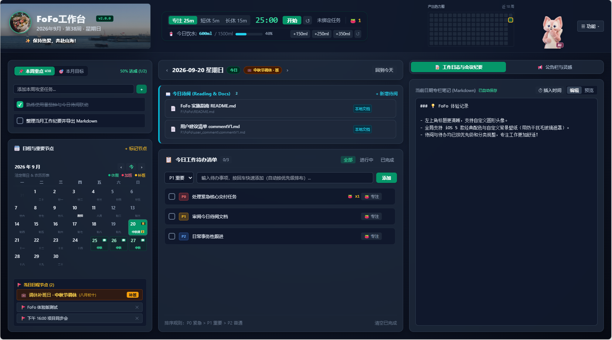
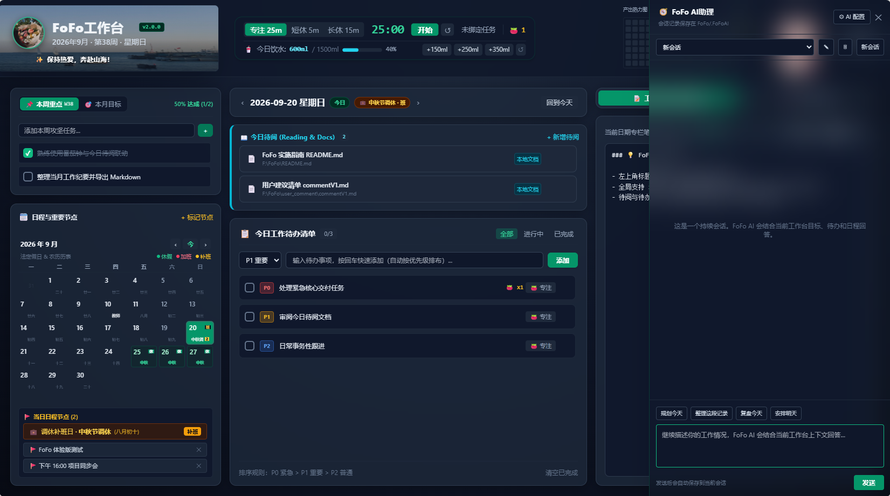
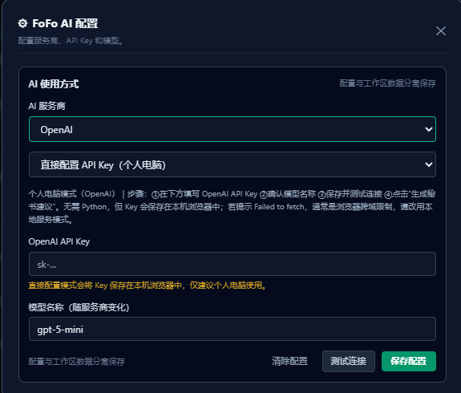
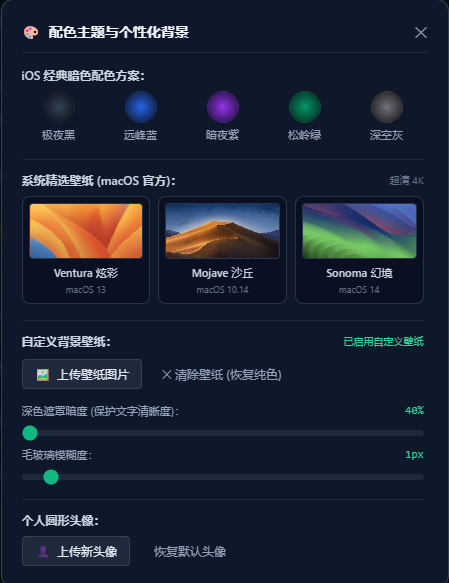
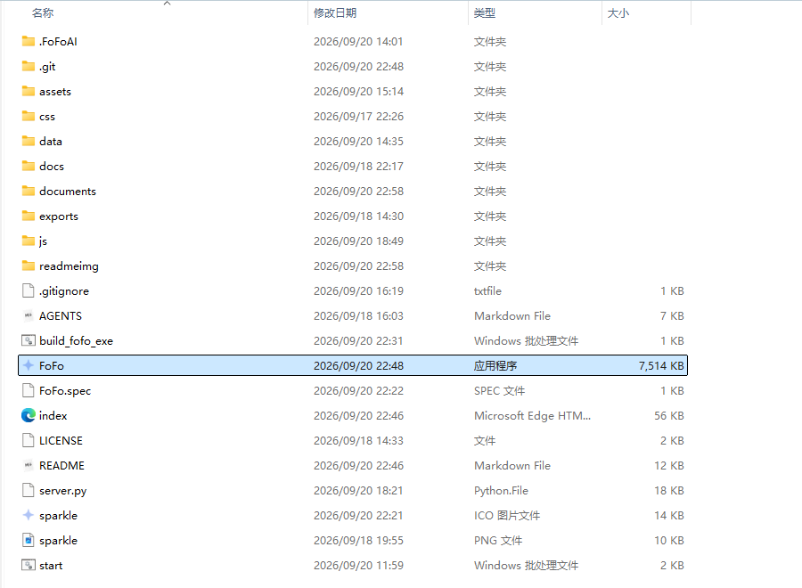

# 🚀 FoFo 个人工作台 (FoFo Personal WorkStation)

<p align="left">
  
  
  
  
</p>

<p align="center">
  
</p>

> **专为重度依赖 Markdown 记录工作流、追求极简高效与时间感知的知识工作者打造的轻量本地化个人生产力中枢。**  
> 告别单篇 Markdown 翻阅繁琐、目标淹没的“巨石文档”痛点，回归优雅清晰的时间心流。

---

## 🏷️ 版本规范与更新日志 (Changelog)

> ### 📌 版本更新规范（后续迭代规则）
> 本项目严格遵循 [Semantic Versioning 2.0.0 (语义化版本规范)](https://semver.org/lang/zh-CN/)（格式：`v主版本号.次版本号.修订号`）：
> - **主版本号 (Major)**：发生重大架构变更或整体重构；
> - **次版本号 (Minor)**：新增业务板块、重要功能特性或重大 UI 升级；
> - **修订号 (Patch)**：针对已有功能的缺陷修复 (Bugfix)、性能优化或细节微调；
> 
> **后续每次发布新版本，必须在此区域以倒序方式（最新版本置顶）追加记录，清晰列出新版本号、发布日期及功能更新明细。**

---

### [v2.0.0] - 2026-09-20

🎉 **FoFo V2.0.0 重大版本里程碑发布！** 引入 AI 智能工作流与独立桌面可执行程序，全面进化为本地优先的智能生产力中枢。

#### 📸 V2.0.0 视觉新特性展示

| 🤖 AI 会话抽屉 | 🐱 玲娜贝儿 AI 桌面伴侣 | ⚙️ 双通道 AI 模型配置 |
| :---: | :---: | :---: |
|  |  |  |

| 🎨 系统官方精选壁纸与 5 色 iOS 经典方案 | 🚀 根目录单文件绿色桌面版 (`FoFo.exe`) |
| :---: | :---: |
|  |  |

#### 🌟 核心新特性

- **FoFo AI 智能工作流秘书**：
  - **抽屉式会话空间**：顶部栏新增 AI 会话快捷抽屉，支持创建多轮持久化会话、会话重命名与归档管理；
  - **智能上下文提取**：一键自动整理并注入当前未完成待办、重要日程与近期日志，辅助快速拆解任务与生成建议；
  - **双通道模型接入**：支持 OpenAI 与 DeepSeek，支持“本地服务环境变量模式”（高安全性）与“浏览器直连配置模式”；
  - **智能落地**：AI 给出的结构化行动建议支持一键转存为今日待办或日程节点。
- **玲娜贝儿 AI 桌面伴侣 (Desk Pet)**：
  - 右下角常驻互动桌面伴侣，支持智能状态气泡互动；
  - 双击或右键呼出快捷控制面板，支持自由拖拽移动与无级缩放，伴随工作心流。
- **系统内置官方高清壁纸**：
  - 在“配色主题与个性化背景”中新增 3 款 macOS 原生 4K 精选壁纸（`macOS Ventura 炫彩`、`macOS Mojave 沙丘`、`macOS Sonoma 幻境`）；
  - 支持一键切换、与 5 种 iOS 暗色微光渐变即时联动，支持灵活调节毛玻璃与遮罩暗度，同时继续保留用户自定义壁纸上传功能。
- **🚀 独立单文件绿色桌面版 (`FoFo.exe`)**：
  - 根目录内置独立编译的可执行程序 `FoFo.exe`，免安装 Python 与任何第三方依赖，双击即开；
  - 匹配专属 `sparkle.ico` 高清图标，原生后台静默托管本地服务并秒级拉起浏览器。

#### 🛠️ 架构加固与体验优化

- **全屏幕跨 DPI 响应式自适应**：重构顶部栏弹性盒子布局与三栏工作台网格，彻底消除旧版负边距位移硬编码，完美适配多显示器跨屏切换、浏览器任意比例缩放（100%~175%）以及笔记本小屏显示；
- **中国大陆节假日历表勘误**：修正 2026年9月20日为国庆节调休补班（非中秋节调休）；
- **全离线化设计**：本地化集成 Tailwind CSS 与 Marked Markdown 渲染引擎，摆脱外部 CDN 限制，断网环境下 100% 稳定运行；
- **DOM 交互规范重构**：重构桌面伴侣按钮嵌套结构，彻底解决原生浏览器解析导致的节点错位与触发偏差；
- **Windows 无控制台环境异常防护**：针对 PyInstaller 打包环境补充标准输入输出流自愈保护，彻底解决静默模式下的启动崩溃；
- **项目结构标准化**：精炼根目录布局，清晰划分源码、构建脚本、静态资源与运行数据，提供专业且干净的工程结构。

---

### [v1.2.0] - 2026-09-18

#### 🌟 新增功能

- **动态个性展板**：支持上传本地个性背景图片、设置动态心情文案，并在顶部栏中预览和管理；
- **日程类型扩展**：新增普通事项、休假、加班三种日程类型，日历支持区分显示休假、加班和调休补班；
- **工作台个性化**：支持自定义工作台名称、同步更新浏览器页面标题，并新增自定义网页图标。

#### 🎨 体验优化

- 优化了顶部栏整体 UI 效果；
- 优化了动态个性展板的显示效果；
- 优化了头像、工作台信息、日期信息和动态文案的层次关系；
- 优化了专注区域、饮水记录和热力图的布局效果；
- 优化了热力图尺寸、位置及标题显示效果；
- 将顶部栏多个功能入口整合为统一的功能菜单；
- 精简了动态个性展板设置弹窗中的提示文案；
- 精简了项目开发文档和交接文档。

---

### [v1.1.0] - 2026-09-18 (中国大陆法定节假日与农历历表支持)

🌟 **核心特性升级**：
- **中国大陆法定节假日全量收录**：精准内置 2024 ~ 2027 年国务院最新法定年节放假及调休安排（涵盖元旦、春节 8 天除夕长假、清明、五一劳动节、端午、中秋、国庆黄金周）；
- **“休” / “班” 角标直观指示**：
  - 法定放假日期右上角标注鲜红底白字 **`休`** 徽标；
  - 调休补班工作日右上角标注琥珀底黑字 **`班`** 徽标；
- **传统节日与公历纪念日标注**：日期下方常驻显示节日缩略名（如“中秋”、“国庆”、“除夕”、“元旦”、“端午”、“重阳”等），悬浮查看包含农历月日、放假性质的完整浮层提示；
- **高精度离线农历算法**：内置中国农历查表推导算法，日常呈现农历月日（如“八月十五”、“初八”、“廿三”）；
- **日程卡片与标题栏联动**：点击任意节假日或调休日期时，左侧日程节点栏与中央标题栏即时展示专属法定假日/补班状态横幅。

---

### [v1.0.0] - 2026-09-18 (首个正式里程碑版本)

🎉 **FoFo 个人工作台首个正式版发布！** 完整实现轻量本地工作流闭环，包含以下核心特性：

#### 🌟 核心板块与工作流
- **三栏结构化面板**：
  - **左侧·主线规划**：支持【📌 本周重点】与【🎯 本月目标】无缝选项卡切换，支持任务上下调序；左下角常驻**重要日程与多事件日历**。
  - **中间·今日执行**：
    - **今日待阅 (Reading & Docs)**：支持快捷添加本地文档（`.md`、`.doc`、`.docx`、`.pdf` 等）与网页链接，点击可直接调用本机原生软件秒级打开，每日独立归档。
    - **待办任务清单**：支持 **`P0 紧急 (红)` > `P1 重要 (黄)` > `P2 普通 (蓝)`** 智能加权优先级自动排序，回车极速创建，任务达成触发全屏彩花庆祝。
  - **右侧·沉淀与随笔**：
    - **工作日志与会议纪要**：内置轻量纯正 Markdown 编辑与实时预览，一键插入精确时间戳，按日自动保存。
    - **双层备忘结构**：上部常驻【📌 备忘公告栏】发布团队原则/长效便签；下部【💡 灵感备忘】随时捕捉碎片想法，支持一键转化为今日待办。

#### ⏱️ 专注与健康体系
- **静音番茄钟 (Pomodoro Focus)**：提供 25m 专注 / 5m 短休 / 15m 长休，支持一键锁定任务倒计时，倒计时归零弹出毛玻璃 Toast 浮窗优雅提醒，快捷键 `Alt + Space`。
- **健康饮水追踪**：每日 1.5L 饮水量追踪，提供 `+150ml`、`+250ml`、`+350ml` 快捷键，达成自动彩花激励。
- **GitHub 风格产出热力图 (Activity Heatmap)**：动态统计近 18 周每日任务完成数与专注番茄次数，鼠标悬浮查看明细，点击格子可任意时光穿梭。

#### 🎨 视觉与美学调优
- **iOS 经典暗色毛玻璃设计**：原生提供【极夜黑】、【远峰蓝】、【暗夜紫】、【松岭绿】、【深空灰】5 种高质感暗色微光渐变。
- **自定义壁纸与头像**：支持上传个人高清壁纸与自定义圆形头像，前端自动无损压缩防超限，支持动态调节暗色遮罩与毛玻璃模糊度。

#### 📦 本地持久化与导出
- **自适应双通道持久化**：有 Python 环境自动启动原生轻量服务写入 `data/workspace.json`；无 Python 环境自动降级纯浏览器 LocalStorage，零依赖开箱即用。
- **一键月度 Markdown 导出**：一键生成排版工整的月度工作全景归档文件，直存 `exports/` 目录或复制。

---

## 🏃 快速启动指南

### 方式 1：独立绿色桌面版（强烈推荐 · 零环境依赖）
直接双击根目录下的 **`FoFo.exe`**：
- 独立 Windows 可执行程序，免装 Python 或任何外部运行时环境；
- 后台自启动本地安全服务并秒级拉起默认浏览器（`http://localhost:3210`）；
- 内置专属工作台图标，所有数据全本地安全留存。

### 方式 2：脚本启动模式（推荐 · 开发者模式）
双击根目录下的 **`start.bat`**：
- 自动检测并调用 Python 环境托管轻量服务，打开默认浏览器；
- 支持调用本地原生应用打开“今日待阅”中的各类格式文档。

### 方式 3：纯浏览器模式（零配置 · 跨平台）
直接双击 **`index.html`** 用任意现代浏览器打开体验。数据基于本地 LocalStorage 存储。

---

## 📚 开发者手册与交接文档索引

FoFo 当前保留精简的 AI 协作与接手规范文档：

| 文档名称 | 路径 | 内容简介 |
| :--- | :--- | :--- |
| **📖 AI 接手文档** | [docs/AI_HANDOVER_AND_DEV_MANUAL.md](docs/AI_HANDOVER_AND_DEV_MANUAL.md) | 当前版本状态、主要文件、AI 接入与后续协作规则 |
| **🤖 AI 协作规则** | [AGENTS.md](AGENTS.md) | AI 开发者操作红线、留痕要求与版本控制原则 |

---

## 📂 项目文件架构

```text
FoFo/
├── FoFo.exe              # 独立单文件绿色桌面程序 (双击即用，免 Python 环境)
├── sparkle.ico           # 应用程序专属高清图标
├── sparkle.png           # 网页版 Favicon 标徽
├── index.html            # 主工作台骨架与布局 (v2.0.0)
├── start.bat             # Windows 开发者启动脚本
├── build_fofo_exe.bat    # 桌面独立版一键构建编译脚本
├── server.py             # 轻量本地托管与文件接口服务
├── README.md             # 项目说明与版本更新日志 (Changelog)
├── AGENTS.md             # AI 协作开发准则
├── LICENSE               # MIT 开源协议
├── .gitignore            # Git 忽略配置文件
│
├── assets/               # 静态资源与桌宠模型图
├── osimg/                # 系统内置官方高清壁纸 (macOS Ventura, Mojave, Sonoma)
├── readmeimg/            # README 功能展示图与特性视觉图
├── css/
│   └── style.css         # 毛玻璃、iOS 5色渐变、热力图、Toast 浮窗样式
├── js/
│   ├── app.js            # 主逻辑控制器、状态机、图像压缩与自适应存储
│   ├── tailwind.min.js   # 本地化离线 CSS 引擎
│   ├── marked.min.js     # 本地化离线 Markdown 解析引擎
│   └── components/
│       ├── pomodoro.js   # 静音番茄钟计时器组件
│       ├── heatmap.js    # 18 周活跃度热力图组件
│       ├── calendar.js   # 交互式日历与单日多日程组件
│       └── export.js     # Markdown 结构化月报导出引擎
│
├── data/                 # 物理存储目录 (workspace.json 快照)
├── documents/            # 每日待阅文档与索引归档目录
├── exports/              # 生成的月度 Markdown 归档文件
└── docs/                 # AI 接手文档与开发手册
```

---

## 📄 开源协议

本项目采用 [MIT 协议](LICENSE) 开源，欢迎自由定制与分享。
