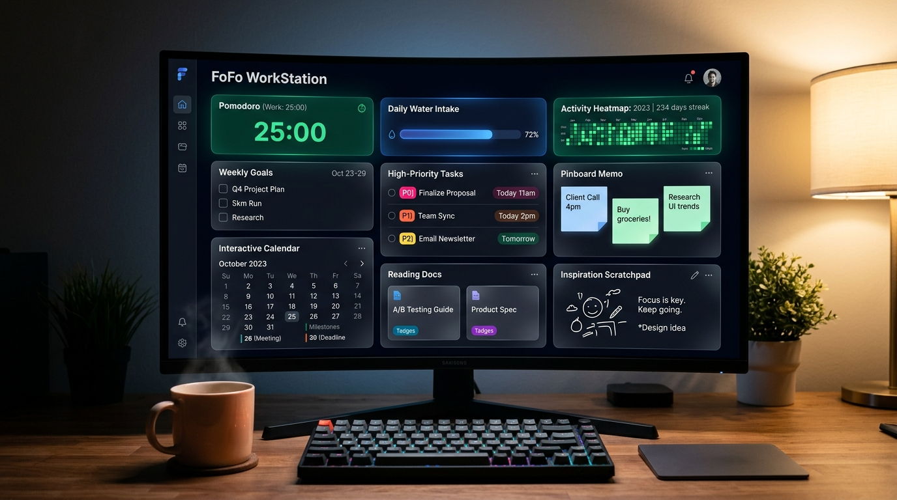

# 🚀 FoFo 个人工作台 (FoFo Personal WorkStation)

<p align="left">
  
  
  
  
</p>

> **专为重度依赖 Markdown 记录工作流、追求极简高效与时间感知的知识工作者打造的轻量本地化个人生产力中枢。**  
> 告别单篇 Markdown 翻阅繁琐、目标淹没的“巨石文档”痛点，回归优雅清晰的时间心流。

---



---

## 🏷️ 版本规范与更新日志 (Changelog)

> ### 📌 版本更新规范（后续迭代规则）
> 本项目严格遵循 [Semantic Versioning 2.0.0 (语义化版本规范)](https://semver.org/lang/zh-CN/)（格式：`v主版本号.次版本号.修订号`）：
> - **主版本号 (Major)**：发生重大架构变更或整体重构；
> - **次版本号 (Minor)**：新增业务板块、重要功能特性或重大 UI 升级；
> - **修订号 (Patch)**：针对已有功能的缺陷修复 (Bugfix)、性能优化或细节微调；
> 
> **后续每次发布新版本，必须在此区域以倒序方式（最新版本置顶）追加记录，清晰列出新版本号、发布日期及功能更新明细。**

---

### [v1.1.0] - 2026-09-18 (中国大陆法定节假日与农历历表支持)

🌟 **核心特性升级**：
- **中国大陆法定节假日全量收录**：精准内置 2024 ~ 2027 年国务院最新法定年节放假及调休安排（涵盖元旦、春节 8 天除夕长假、清明、五一劳动节、端午、中秋、国庆黄金周）；
- **“休” / “班” 角标直观指示**：
  - 法定放假日期右上角标注鲜红底白字 **`休`** 徽标；
  - 调休补班工作日右上角标注琥珀底黑字 **`班`** 徽标；
- **传统节日与公历纪念日标注**：日期下方常驻显示节日缩略名（如“中秋”、“国庆”、“除夕”、“元旦”、“端午”、“重阳”等），悬浮查看包含农历月日、放假性质的完整浮层提示；
- **高精度离线农历算法**：内置中国农历查表推导算法，日常呈现农历月日（如“八月十五”、“初八”、“廿三”）；
- **日程卡片与标题栏联动**：点击任意节假日或调休日期时，左侧日程节点栏与中央标题栏即时展示专属法定假日/补班状态横幅。

---

### [v1.0.0] - 2026-09-18 (首个正式里程碑版本)

🎉 **FoFo 个人工作台首个正式版发布！** 完整实现轻量本地工作流闭环，包含以下核心特性：

#### 🌟 核心板块与工作流
- **三栏结构化面板**：
  - **左侧·主线规划**：支持【📌 本周重点】与【🎯 本月目标】无缝选项卡切换，支持任务上下调序；左下角常驻**重要日程与多事件日历**。
  - **中间·今日执行**：
    - **今日待阅 (Reading & Docs)**：支持快捷添加本地文档（`.md`、`.doc`、`.docx`、`.pdf` 等）与网页链接，点击可直接调用本机原生软件秒级打开，每日独立归档。
    - **待办任务清单**：支持 **`P0 紧急 (红)` > `P1 重要 (黄)` > `P2 普通 (蓝)`** 智能加权优先级自动排序，回车极速创建，任务达成触发全屏彩花庆祝。
  - **右侧·沉淀与随笔**：
    - **工作日志与会议纪要**：内置轻量纯正 Markdown 编辑与实时预览，一键插入精确时间戳，按日自动保存。
    - **双层备忘结构**：上部常驻【📌 备忘公告栏】发布团队原则/长效便签；下部【💡 灵感备忘】随时捕捉碎片想法，支持一键转化为今日待办。

#### ⏱️ 专注与健康体系
- **静音番茄钟 (Pomodoro Focus)**：提供 25m 专注 / 5m 短休 / 15m 长休，支持一键锁定任务倒计时，倒计时归零弹出毛玻璃 Toast 浮窗优雅提醒，快捷键 `Alt + Space`。
- **健康饮水追踪**：每日 1.5L 饮水量追踪，提供 `+150ml`、`+250ml`、`+350ml` 快捷键，达成自动彩花激励。
- **GitHub 风格产出热力图 (Activity Heatmap)**：动态统计近 18 周每日任务完成数与专注番茄次数，鼠标悬浮查看明细，点击格子可任意时光穿梭。

#### 🎨 视觉与美学调优
- **iOS 经典暗色毛玻璃设计**：原生提供【极夜黑】、【远峰蓝】、【暗夜紫】、【松岭绿】、【深空灰】5 种高质感暗色微光渐变。
- **自定义壁纸与头像**：支持上传个人高清壁纸与自定义圆形头像，前端自动无损压缩防超限，支持动态调节暗色遮罩与毛玻璃模糊度。

#### 📦 本地持久化与导出
- **自适应双通道持久化**：有 Python 环境自动启动原生轻量服务写入 `data/workspace.json`；无 Python 环境自动降级纯浏览器 LocalStorage，零依赖开箱即用。
- **一键月度 Markdown 导出**：一键生成排版工整的月度工作全景归档文件，直存 `exports/` 目录或复制。

---

## 🏃 快速启动指南

### 方式 1：一键双击启动（推荐 · 全功能模式）
直接双击根目录下的 **`start.bat`**：
- 自动调用 Python 轻量服务托管，并在默认浏览器中秒级打开（`http://localhost:3210`）；
- 此模式下，点击“今日待阅”卡片可直接调用 Windows 原生应用（如 Word、PDF 阅读器、Typora）打开本地文档。

### 方式 2：纯浏览器模式（零配置 · 跨平台）
直接双击 **`index.html`** 用任意现代浏览器（Chrome / Edge / Safari）打开体验。无需安装任何环境，离线完全可用！

---

## 📚 开发者手册与交接文档索引

FoFo 的全流程设计理念、数据字典与交互细节已全面归档于 **`docs/`** 目录：

| 文档名称 | 路径 | 内容简介 |
| :--- | :--- | :--- |
| **📖 AI 开发者接手全景指南** | [docs/AI_HANDOVER_AND_DEV_MANUAL.md](docs/AI_HANDOVER_AND_DEV_MANUAL.md) | **核心指南**：产品哲学、技术架构、全量数据字典、API 规范与交接手册 |
| **🌐 AI 结对编程全记录 (HTML)** | [docs/AI_COLLABORATION_LOG.html](docs/AI_COLLABORATION_LOG.html) | **单文件独立自包含**：完整记录 17 轮人机结对对话、思考、工具调用与产品图，支持浏览器直接阅读与转 PDF |
| **📝 AI 结对编程全记录 (Markdown)** | [docs/AI_COLLABORATION_LOG.md](docs/AI_COLLABORATION_LOG.md) | Markdown 版全流程对话纪要，包含清晰目录大纲与交互明细 |
| **🛠️ MVP 初始实施方案** | [docs/implementation_plan_v1.0.md](docs/implementation_plan_v1.0.md) | MVP 阶段模块规划与技术选型方案 |
| **⚡ v1.1 优化实施方案** | [docs/implementation_plan_v1.1.md](docs/implementation_plan_v1.1.md) | 基于用户首份反馈建议重构落地方案 |
| **✅ v1.1 功能验收与总结** | [docs/walkthrough_v1.1.md](docs/walkthrough_v1.1.md) | 待阅、饮水、日程多事件与排版修复验收总结 |

---

## 📂 项目文件架构

```text
FoFo/
├── index.html            # 主工作台页面骨架 (v1.0.0)
├── start.bat             # Windows 一键启动脚本
├── server.py             # 极轻量本地服务 (提供原生文件打开与本地磁盘读写)
├── fofo_product_showcase.jpg # 产品高清渲染展示大图
├── README.md             # 项目说明与版本更新日志 (Changelog)
├── .gitignore            # Git 忽略配置文件
│
├── css/
│   └── style.css         # 毛玻璃、iOS 5色渐变、热力图、Toast 浮窗样式
├── js/
│   ├── app.js            # 主逻辑控制器、状态机、图像压缩与自适应存储
│   └── components/
│       ├── pomodoro.js   # 静音番茄钟计时器组件
│       ├── heatmap.js    # 18 周活跃度热力图组件
│       ├── calendar.js   # 交互式日历与单日多日程组件
│       └── export.js     # Markdown 结构化月报导出引擎
│
├── data/                 # 物理存储目录 (workspace.json 快照)
├── documents/            # 每日待阅文档与索引归档目录
├── exports/              # 生成的月度 Markdown 归档文件
├── user_comment/         # 用户体验反馈与建议归档
└── docs/                 # 技术设计方案、AI 开发者手册与结对会话记录
```

---

## 📄 开源协议

本项目采用 [MIT 协议](LICENSE) 开源，欢迎自由定制与分享。
